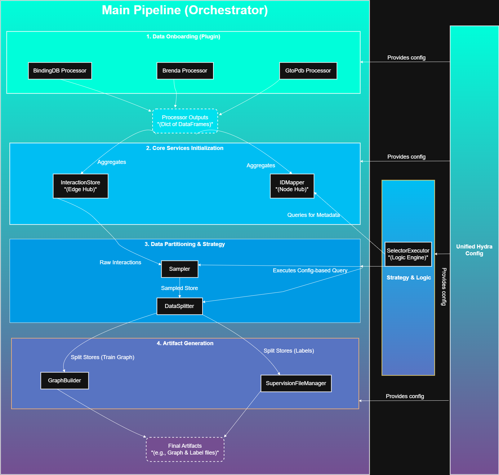

# HelixPipe: 面向药物发现的策略驱动型异构图学习框架

`HelixPipe` 是一个为“药物-靶点相互作用（DTI）”研究量身打造的、准工业级的数据处理与图学习框架。它的核心任务是将来自不同生物信息学数据库的、原始且异构的数据源，自动化地处理、清洗、整合，并最终构建成可直接用于图神经网络（GNN）训练的知识图谱。

与简单的处理脚本不同，`HelixPipe` 的核心设计哲学是**策略驱动（Strategy-Driven）**：复杂的实验范式（如数据采样策略、冷启动划分规则、评估范围等）均通过声明式的 **YAML 配置文件**来定义，而非在 Python 代码中硬编码。

## 核心架构

整个数据流水线由一个中心的 `main_pipeline` 模块负责总编排。它协调一系列各司其职的、遵循单一职责原则的服务。整个架构构建于**节点 (`IDMapper`) 与边 (`InteractionStore`) 的双核心数据模型**之上，并由一个声明式的策略执行引擎 (`SelectorExecutor`) 负责驱动。

---

## 关键特性与设计哲学

`HelixPipe` 不仅仅是一个数据处理脚本的集合，它是在科研场景下对现代软件工程原则的一次深度实践。

- **✨ 双核心数据模型 (ADR-006, ADR-008):**

  - **`IDMapper` (实体/节点中心):** 作为所有实体（节点）的“单一事实来源”，负责管理全局唯一的实体身份、多重类型（如 `drug`, `ligand`）以及其数据来源。
  - **`InteractionStore` (交互/边中心):** 作为所有关系（边）的中央仓库，提供了一套强大的、遵循不可变模式的 API，用于交互的查询、筛选与规范化。

- **🚀 策略驱动与声明式设计 (ADR-007, ADR-009):**

  - 实验逻辑完全从代码中解耦，通过 **YAML 文件**进行声明。研究人员无需修改代码，即可“发明”全新的实验设置。
  - **`SelectorExecutor` (策略执行引擎):** 作为一个独立的逻辑层，负责解释并执行 `Selector` 配置，以声明式的方式完成对节点和边的复杂筛选，赋予了框架无与伦比的灵活性。

- **🧩 插件化的数据源接入 (ADR-003):**

  - 可轻松集成新的数据源（如 DrugBank）。只需为其编写一个新的 `Processor` 类（“翻译器”插件），负责将原始数据转换为内部的规范化交互格式，而核心流水线无需任何改动。

- **🛡️ 健壮的中心化数据校验 (ADR-005):**

  - 采用多阶段、以流水线为中心的校验流程，确保所有数据（无论来源）都经过统一的“质检”，从根本上保证了下游模型输入的数据质量和一致性。

- **⚙️ 严谨的工程实践:**
  - **架构决策记录 (ADR):** 在 `/docs/adr` 目录下，系统地记录了从旧架构演进到新架构的关键决策和权衡，清晰地阐述了“为什么”这么设计。
  - **全面的单元测试:** 核心服务（如 `InteractionStore`, `SelectorExecutor`）都经过了严格的单元测试，确保了代码的可靠性和可维护性。
  - **配置即代码 (Hydra):** 利用 `Hydra` 和结构化配置 (`dataclasses`)，实现了类型安全、可组合、可复现的实验管理。

## 技术栈

- **核心语言:** Python 3.9+
- **机器学习:** PyTorch
- **图神经网络:** PyTorch Geometric (PyG)
- **数据处理:** Pandas
- **配置管理:** Hydra
- **化学信息学:** RDKit
- **生物信息学 API:** Bioservices (用于 UniProt)
